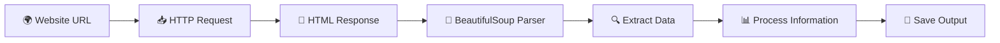

<div align="center">


<br><br>


<br><br>

<p align="center">


</p>

<br>

<h2>🕸️ Intelligent Web Data Extraction Using Python 🕸️</h2>

<p align="center">
A Python-based web scraping project developed using BeautifulSoup for extracting, parsing, and analyzing structured web data efficiently.
</p>

</div>

---

# 🌐 About The Project

## 🚀 Web Scraping Using BeautifulSoup

This project demonstrates the implementation of **web scraping techniques** using **Python** and **BeautifulSoup** to collect and process data from websites.

The project focuses on:

- 🌍 Automated data extraction
- 🧹 HTML parsing and cleaning
- 📊 Structured data collection
- ⚡ Fast scraping workflows
- 📂 Exporting scraped information
- 🔍 Real-world scraping practices

Beautiful Soup is a Python library commonly used for parsing HTML and XML documents in web scraping workflows. :contentReference[oaicite:0]{index=0}

---

# ✨ Features

<div align="center">

| 🚀 Feature | 📌 Description |
|---|---|
| 🌐 Website Data Extraction | Scrape website content automatically |
| 📄 HTML Parsing | Extract structured HTML data |
| 🔍 Tag & Element Search | Locate elements efficiently |
| 📊 Data Collection | Organize extracted information |
| ⚡ Fast Processing | Lightweight scraping workflow |
| 📁 Export Support | Save extracted data |
| 🧠 Learning-Oriented | Understand scraping concepts |
| 🛠️ Reusable Scripts | Easy customization |

</div>

---

# 📚 What Is Web Scraping?

Web scraping is the process of extracting information from websites using automated scripts.

This project uses:

- **Requests** → Fetch webpage content
- **BeautifulSoup** → Parse HTML structure
- **Python** → Process and organize extracted data

BeautifulSoup is widely used for navigating, searching, and modifying parse trees in HTML and XML files. :contentReference[oaicite:1]{index=1}

---

# ⚙️ Tech Stack

<div align="center">

<table>

<tr>

<td align="center" width="180">
<br>
<b>Python</b>
</td>

<td align="center" width="180">
<br>
<b>VS Code</b>
</td>

<td align="center" width="180">
<br>
<b>GitHub</b>
</td>

<td align="center" width="180">
<br>
<b>Git</b>
</td>

</tr>

</table>

</div>

---

# 📦 Python Libraries Used

<div align="center">

| 📚 Library | 🚀 Purpose |
|---|---|
| Requests | Fetch webpage content |
| BeautifulSoup4 | Parse HTML documents |
| Pandas | Store and process data |
| CSV | Export scraped data |

</div>

Web scraping projects commonly use Requests, BeautifulSoup4, and Pandas for data extraction and processing pipelines. :contentReference[oaicite:2]{index=2}

---

# 🧩 Workflow Architecture



---

# 📸 Project Preview

<div align="center">


</div>

---

# 🛠️ Installation Guide

## 📥 Clone Repository

```bash
git clone https://github.com/Nksnaveenks/web_scraping_BeautifulSoup.git
```

---

## 📂 Navigate To Project Folder

```bash
cd web_scraping_BeautifulSoup
```

---

## 📦 Install Required Libraries

```bash
pip install requests
pip install beautifulsoup4
pip install pandas
```

You can also install dependencies using:

```bash
pip install -r requirements.txt
```

BeautifulSoup4 and Requests are commonly installed together for HTML parsing and web scraping workflows. :contentReference[oaicite:3]{index=3}

---

# ▶️ Run The Project

```bash
python main.py
```

OR run any scraper file individually:

```bash
python scraper.py
```

---

# 📂 Repository Structure

```bash
📦 web_scraping_BeautifulSoup
 ┣ 📂 data
 ┣ 📂 output
 ┣ 📂 scripts
 ┣ 📜 main.py
 ┣ 📜 scraper.py
 ┣ 📜 requirements.txt
 ┣ 📜 README.md
 ┗ 📜 .gitignore
```

---

# 🔍 Scraping Functionalities

## 🌐 Website Scraping
- Fetch website HTML
- Read webpage content

## 🧹 HTML Parsing
- Extract tags and elements
- Parse structured data

## 📊 Data Extraction
- Collect useful information
- Convert data into structured format

## 💾 Data Export
- Store data into CSV or text files

Projects using BeautifulSoup often extract tables, product information, article content, and metadata from webpages. :contentReference[oaicite:4]{index=4}

---

# 📈 Learning Outcomes

<div align="center">

| 📘 Concept | 🚀 Skills Learned |
|---|---|
| HTTP Requests | Fetching web pages |
| HTML Parsing | Navigating DOM structure |
| BeautifulSoup | Data extraction |
| Python Automation | Workflow automation |
| Data Processing | Organizing scraped data |

</div>

---

# 🎯 Project Objectives

✅ Learn web scraping fundamentals  
✅ Understand HTML parsing  
✅ Build automation scripts  
✅ Extract structured web data  
✅ Practice real-world Python development  

---

# 🌟 Future Improvements

- 🤖 AI-based scraping automation
- 🌍 Multi-page crawling support
- ☁️ Cloud deployment
- 📊 Dashboard visualization
- 🔐 Proxy & CAPTCHA handling
- ⚡ Async scraping implementation
- 🧠 Selenium integration

Selenium is often combined with BeautifulSoup for scraping dynamic websites and JavaScript-rendered pages. :contentReference[oaicite:5]{index=5}

---

# 🤝 Contribution Guide

Contributions are welcome!

## 📌 Steps To Contribute

### 1️⃣ Fork Repository

### 2️⃣ Clone Repository

```bash
git clone https://github.com/your-username/web_scraping_BeautifulSoup.git
```

### 3️⃣ Create New Branch

```bash
git checkout -b feature-name
```

### 4️⃣ Commit Changes

```bash
git commit -m "Added new scraping feature"
```

### 5️⃣ Push Changes

```bash
git push origin feature-name
```

### 6️⃣ Open Pull Request 🚀

---

# 🛡️ License

Licensed under the **MIT License**.

---

# 👨‍💻 Developer

<div align="center">


# 🚀 Naveen K S

### Associate Software Engineer @ Accenture

<br>

<a href="https://github.com/Nksnaveenks">

</a>

<a href="https://linkedin.com">

</a>

</div>

---

# 💭 Inspiration

> “Data is valuable, but extracting it intelligently is powerful.”

---

<div align="center">


# ⭐ Star This Repository If You Like The Project ⭐

</div>
